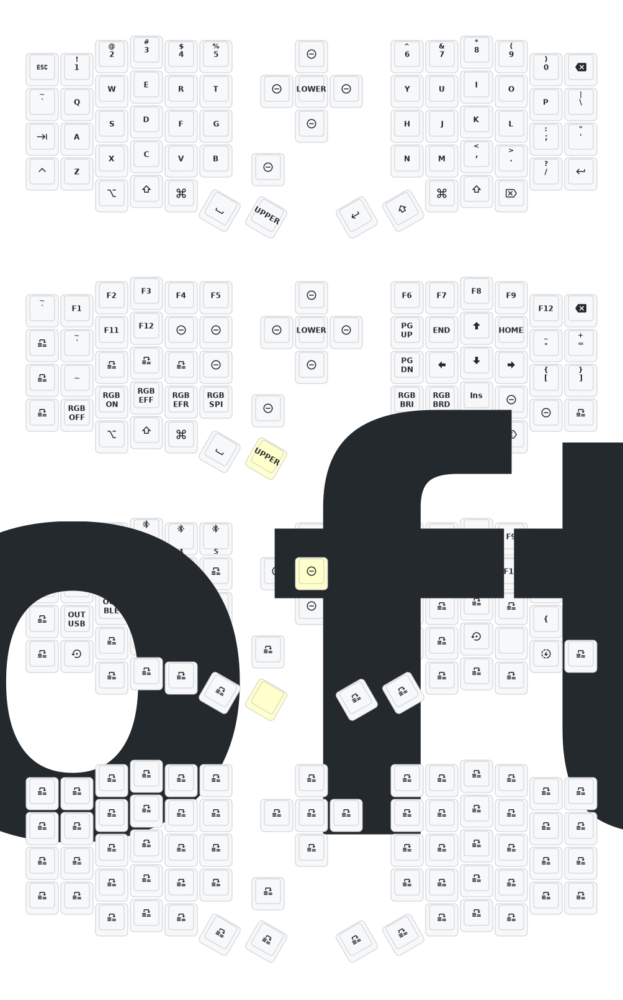

# Sofle

## Update List

- 2024/12/21
  1. Added support for zmk-studio (just refresh the left hand to use).
- 2024/10/24
  1. Modified power supply mode to reduce power consumption.
  2. Fixed the automatic shut-off feature for RGB power supply.
- 2025/3/30
  1. Increased sleep entry time to 1 hour, added debounce time, optimized power consumption after sleep.
- 2025/8/22
  1. Updated soft off feature. Press and hold Q, S, and Z keys simultaneously for 2 seconds to enter deep sleep (cannot wake with key press, use reset switch to wake).
  2. Updated low-profile Sofle and Corne cases with thicker frame and bottom plate, adjusted reset switch opening.
  3. Removed GIF animation from right keyboard screen to significantly reduce power consumption.

> If your keyboard was updated before August 22, 2025, please update to the latest firmware.

---

# Contact Me

For 3D printed model files or any issues and malfunctions with the keyboard, please contact 380465425@qq.com

# Sofle Keymap

